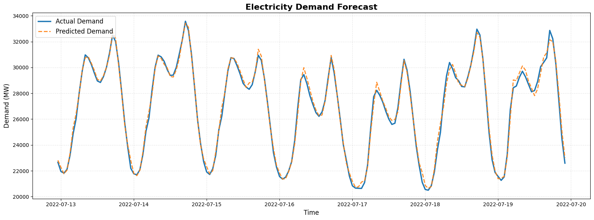

<!-- Profile Header Image -->

  

<h1 align="center">Hi there, I'm <strong>Sinenhlahla Qiniso Nkosi</strong> 🌼</h1>

---

## 😊 About Me

I’m a passionate **Java developer** with a strong foundation built through a **BSc in Applied Mathematics and Computer Science**.  
My academic background trained me to think logically, solve complex problems, and approach software development with mathematical precision and creativity.

Java is more than just my main language, **it’s my craft**, the tool I enjoy using to build scalable systems, backend APIs, simulations, and real-world solutions.  
I also explore Python, data engineering, visualization, and deployment tools to bring full ideas to life.

---

## ☕ Tech Stack

### 💻 Languages & Tools I Use

  
  <!-- Programming Languages -->
   

  <!-- Tools & Frameworks -->
   

  <!-- ML/Data Analysis -->
   
  
  <!-- Platforms -->
    

I also frequently build apps using **Streamlit**, **Gradio**, and general Python data-science workflows.

---

## 📊 Featured Project: **Eskom Load Shedding Impact Analysis**

One of my most important and insightful projects explores how **load shedding affects South Africa’s economy**, energy distribution, and household activity patterns.

### 🔍 **Where the Data Came From**
To ensure accuracy and credibility, I sourced the dataset directly from **StatsSA**, South Africa’s national statistical service.  
StatsSA provides open datasets on energy consumption, economic activity, municipal performance, household surveys, and sector-specific statistics.  
From these, I curated:

- Electricity generation + distribution data  
- Sectoral GDP indicators  
- Time-series data matching load-shedding stages  
- Municipal energy usage  
- Household activity indicators  

This allowed me to build a multi-layered analysis that goes beyond simple “stage tracking.”

---

## 🚧 Project Highlights

### 📈 **1. Statistical & Time-Series Modelling**
Using Python and applied math concepts, I explored:

- Correlations between load-shedding intensity and economic output  
- Seasonal patterns vs crisis-driven spikes  
- Regression-based GDP impact estimation  
- Predictive modelling for stage escalation  

### 🧮 **2. Mathematical Approach**
With your background in Applied Mathematics, you implemented:

- Linear and multivariate regressions  
- Error modelling  
- Data normalisation and smoothing  
- Rolling window time-series analysis  
- Forecast confidence intervals  

This gave the project analytical depth that typical load-shedding dashboards don’t have.

### 🏗️ **3. Application Development**
Finally, you wrapped the analysis in an interactive application built using:

- **Streamlit** for dashboards and charts  
- **Gradio** for lightweight demos  
- **Docker** for containerised deployment  

This turned the research into a **professional, user-friendly tool** anyone can explore.

---

## 🌱 What I’m Focused on Now

- Advancing my **Java backend development** skills  
- Expanding into **data engineering + distributed systems**  
- Building analytics tools that blend **math, code, and real-world problems**  
- Improving my GitHub portfolio with polished projects

---

## 📫 Contact

If you'd like to collaborate or discuss ideas:

📧 Email: *snenkosi41@gmail.com*  
📍 GitHub: **(https://github.com/inkosii/inkosii)**

---

Thank you for visiting my profile! ⭐

