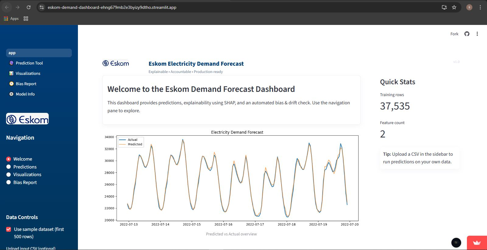
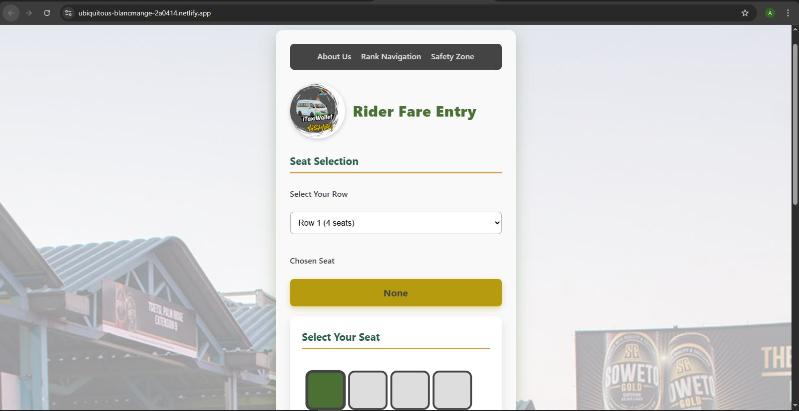

<!-- Profile Header Image -->

  

<h1 align="center">Hi there, I'm <strong>Name Surname</strong> 🌼</h1>

---

## 😊 About Me

I’m a passionate **Java developer** with a solid academic foundation through a  
**BSc in Applied Mathematics and Computer Science**.

My degree shaped the way I think — logically, analytically, and creatively —  
allowing me to approach software development with mathematical precision.  

Java isn’t just a language for me —  
**it’s my craft**, the tool I use to build scalable systems, backend logic, and analytical applications.  
I also develop data-driven solutions in Python, using visualization and modeling tools to explore real-world problems.

---

## ☕ Tech Stack

### 💻 Languages & Tools I Use

  
  <!-- Programming Languages -->
   

  <!-- Tools -->
   

  <!-- ML/Data Analysis -->
   

  <!-- Platforms -->
  

I frequently build interactive data apps using **Streamlit**, **Gradio**, and Python’s scientific ecosystem.

---

# 🎮 Pac-Man Contribution Animation

  <picture>
    <source media="(prefers-color-scheme: dark)" srcset="https://raw.githubusercontent.com/${GITHUB_USERNAME}/${GITHUB_USERNAME}/output/pacman-contribution-graph-dark.svg">
    <source media="(prefers-color-scheme: light)" srcset="https://raw.githubusercontent.com/${GITHUB_USERNAME}/${GITHUB_USERNAME}/output/pacman-contribution-graph.svg">
    
  </picture>

> 🎉 *This Pac-Man animation automatically updates every 12 hours using GitHub Actions!*

---

# 📊 Featured Project (Primary):  
# **Eskom Load Shedding Impact Analysis**

A deep, data-driven exploration of how **load shedding affects South Africa’s economy**,  
municipal energy usage, and household activity patterns.

This project blends:

✔ Applied Mathematics  
✔ Statistical modeling  
✔ Real-world South African data  
✔ Interactive visual applications  

---

## 🔍 Data Collection — From StatsSA

All datasets were sourced directly from **StatsSA**, including:

- Electricity generation & distribution  
- Municipal energy usage datasets  
- Sectoral GDP indicators  
- Household energy/activity datasets  
- Time-series data aligned to load-shedding cycles  

Using national-level datasets ensures **accuracy, credibility, and analytical depth**.

---

## 🚧 Project Highlights

### 📈 **1. Time-Series & Statistical Modeling**
I implemented:

- Correlation analysis (load-shedding severity vs GDP impact)  
- Time-series decomposition  
- Rolling window forecasting  
- Regression-based impact modeling  
- Seasonal cycle detection  

### 🧮 **2. Mathematical Foundations**
Based on my Applied Math training, I used:

- Multivariate regression  
- Smoothing & detrending  
- Normalization  
- Error modeling  
- Confidence interval forecasting  

### 🏗️ **3. Application Layer**
To make insights accessible:

- **Streamlit dashboards**  
- **Gradio demos**  
- **Dockerized builds** for deployment  

This transformed complex analysis into a **user-friendly, interactive energy insights tool**.

---

# 🚖 Secondary Project:  
# **South African Taxi Fare & Route App** (Summary)

  

A modern, browser-based application bringing **structure, clarity, and convenience** to the South African minibus taxi system.  
Inspired by the real taxi-rank look and feel — clean, bold, and authentic.

---

## 🌟 Key Features (Short Summary)

- 🔍 **Fare Search** (autocomplete + voice search)  
- 🪑 **Seat Selection** (SVG-based taxi layout)  
- 📱 **QR Payment Screen**  
- 🧭 **Rank Navigation** + routes  
- 🛡️ **Safety Zone** (tips + emergency numbers)  
- 📞 **Contact & Report Forms**  
- 🎨 A modern SA-style UI  

---

## 🛠️ Tech Stack

- **HTML, CSS, JavaScript**  
- **JSON sheets** for fare & route data  
- **SVG graphics** for seat plans  

This project brings digital structure to a system millions rely on — improving access, clarity, and safety.

---

## 🌱 Current Focus

- Advancing my **Java backend expertise**  
- Diving deeper into **data engineering & distributed systems**  
- Blending math + software to solve real SA problems  
- Expanding my GitHub with polished, meaningful work  

---

## 📫 Contact

📧 Email: **name@gmail.com**  
🔗 GitHub: **https://github.com/user/user**

---

Thank you for visiting my profile! ⭐

