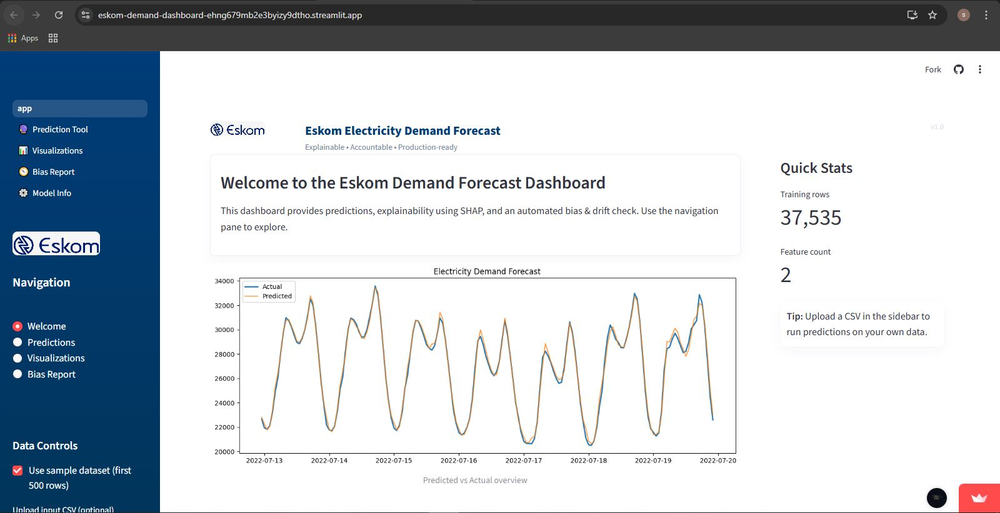

<!-- ====================================================== -->
<!--                       ASCII BANNER                     -->
<!--                       (INKOSII)                        -->
<!-- ====================================================== -->

<pre>
  ____   _                      _      _         _      _         
 / ___| (_) _ __    ___  _ __  | |__  | |  __ _ | |__  | |  __ _  
 \___ \ | || '_ \  / _ \| '_ \ | '_ \ | | / _` || '_ \ | | / _` | 
  ___) || || | | ||  __/| | | || | | || || (_| || | | || || (_| | 
 |____/ |_||_| |_| \___||_| |_||_| |_||_| \__,_||_| |_||_| \__,_| 
   ___   _         _                  _   _  _                _   
  / _ \ (_) _ __  (_) ___   ___      | \ | || | __ ___   ___ (_)  
 | | | || || '_ \ | |/ __| / _ \     |  \| || |/ // _ \ / __|| |  
 | |_| || || | | || |\__ \| (_) |    | |\  ||   <| (_) |\__ \| |  
  \__\_\|_||_| |_||_||___/ \___/     |_| \_||_|\_\\___/ |___/|_|  
</pre>

---

<!-- ====================================================== -->
<!--                      HEADER BANNER                     -->
<!-- ====================================================== -->

  

<!-- ====================================================== -->
<!--                    ANIMATED GREETING                   -->
<!-- ====================================================== -->

  

---

## 👋 About Me

**Sinenhlahla Qiniso Nkosi** — Software Developer with a **BSc in Applied Mathematics & Computer Science** and a passion for **enterprise architecture**, **machine learning**, and **practical problem-solving**.

I specialize in building **scalable backend systems**, **cloud-native architectures**, **AI/ML pipelines**, and **data analytics solutions** with clear structure, elegant logic, and measurable real-world impact.

**Current Focus:**
- 🏢 **Enterprise Java:** Microservices, Spring Boot, REST APIs, System Design
- ☁️ **Cloud-Native:** Docker, Kubernetes, Monitoring (Prometheus, Grafana), Distributed Systems
- 🤖 **AI/ML:** NLP, Cross-lingual embeddings, Time-series forecasting, Model evaluation
- 📊 **Data Engineering:** Python, Pandas, Streamlit dashboards, Statistical analysis
- 🌐 **Full-Stack:** HTML5, CSS3, JavaScript, responsive UI design

---

<!-- ====================================================== -->
<!--                    CONTRIBUTION GRAPH                  -->
<!-- ====================================================== -->

  <picture>
    <source media="(prefers-color-scheme: dark)" srcset="https://raw.githubusercontent.com/inkosii/inkosii/output/pacman-contribution-graph-dark.svg">
    <source media="(prefers-color-scheme: light)" srcset="https://raw.githubusercontent.com/inkosii/inkosii/output/pacman-contribution-graph.svg">
    
  </picture>

  <i>Every commit represents another opportunity to learn, improve, and build.</i>

---

## 🛠️ Tech Stack & Skills

   
   
  

| **Domain** | **Skills** |
|---|---|
| **Backend & Enterprise** | Java, Spring Boot, Microservices, REST APIs, Design Patterns, OOP, Unit Testing |
| **Cloud & DevOps** | Docker, Docker Compose, Kong API Gateway, CI/CD, Monitoring (Prometheus, Grafana), ELK Stack |
| **AI/ML & Data** | Python, NLP, Cross-lingual embeddings, ARIMA/ARIMAX, Time-series analysis, scikit-learn, PyTorch |
| **Data Engineering** | Pandas, NumPy, Streamlit, Jupyter Notebooks, Data visualization, Statistical analysis |
| **Frontend & Web** | HTML5, CSS3, JavaScript, Responsive design, SVG, Interactive UIs |
| **Databases** | PostgreSQL, SQL, Entity-Relationship modeling, Database design |
| **Soft Skills** | System design, Problem-solving, Technical documentation, Reproducible research |

---

## 📌 Featured Projects

### 🔝 #1: Cloud-Sim Bank — Enterprise Microservices Architecture

**Repository:** [@youth_cloud_banking_system](https://github.com/inkosii/youth_cloud_banking_system)

**Goal:** Design and implement a production-ready, cloud-native banking platform demonstrating enterprise software architecture, distributed systems, and operational excellence.

#### Architecture Overview

  

#### What I Built

- ✅ **Microservices Architecture:**
  - Account Service (Java Spring Boot) – User account management on port 8081
  - Transaction Service (Java Spring Boot) – Banking transactions on port 8082
  - FastAPI Integration Service – Optional backend service on port 8001

- ✅ **API Gateway Layer:**
  - Kong API Gateway for request routing, rate limiting, and security enforcement (port 8000)
  - Comprehensive API documentation and testing

- ✅ **Data Persistence:**
  - PostgreSQL database with proper ER modeling
  - Entity-relationship design for accounts, transactions, and dependencies
  - Referential integrity and normalized schema

- ✅ **Observability Stack:**
  - **Prometheus + Grafana:** Full-stack metrics collection and visualization
  - Dashboards for request throughput, latency, microservice health, database performance
  - Real-time monitoring of distributed services

- ✅ **Centralized Logging:**
  - ELK Stack (Elasticsearch, Logstash, Kibana) for log aggregation
  - Searchable, structured logging across all services
  - Kibana dashboards for log analysis and troubleshooting

- ✅ **Containerization & Orchestration:**
  - Docker Compose for local orchestration
  - Multi-container deployment with service networking
  - Environment variable management and service discovery

#### Key Components
| Service | Framework | Purpose | Port |
|---|---|---|---|
| Account Service | Java Spring Boot | User account operations | 8081 |
| Transaction Service | Java Spring Boot | Transaction processing | 8082 |
| FastAPI | Python FastAPI | Backend integration | 8001 |
| Kong API Gateway | Kong | Request routing & security | 8000 |
| Database | PostgreSQL | Persistent storage | 5432 |
| Monitoring | Prometheus + Grafana | Metrics & visualization | 9090, 3000 |
| Logging | ELK Stack | Centralized logs | 9200, 5601 |

#### Technologies & Best Practices
- **Microservices:** Service-oriented architecture with clear separation of concerns
- **API Gateway:** Single entry point with request filtering and authentication
- **Monitoring:** Observable systems with metric collection and visualization
- **Logging:** Structured logging for debugging and troubleshooting
- **Containerization:** Docker for consistency across environments
- **Documentation:** Architecture diagrams, ER models, API documentation

[🔗 Explore Project](https://github.com/inkosii/youth_cloud_banking_system) | [📖 View Documentation](https://github.com/inkosii/youth_cloud_banking_system/tree/main/Documentation)

---

### 🔝 #2: Cross-Lingual Word Embeddings for South African Languages

**Repository:** [@Cross-Lingual-Embeddings-NLP-2026](https://github.com/inkosii/Cross-Lingual-Embeddings-NLP-2026)

**Goal:** Research and develop cross-lingual word embeddings for isiZulu, Sepedi, and Setswana, addressing the challenge of multilingual NLP in low-resource African languages.

**Context:** Completed as part of my Honours Natural Language Processing coursework, this project explores embedding alignment strategies and multilingual semantic space optimization.

#### What I Built

- ✅ **Cross-Lingual Embeddings:**
  - FastText word embeddings for South African languages (isiZulu, Sepedi, Setswana)
  - Orthogonal Procrustes alignment for semantic space mapping
  - Evaluation of embedding quality across language pairs

- ✅ **Alignment Strategies:**
  - Monolingual embedding training
  - Bilingual lexicon-based alignment
  - Orthogonal mapping and refinement techniques
  - Cross-lingual evaluation metrics

- ✅ **Comprehensive Evaluation:**
  - Bilingual lexicon induction evaluation
  - Cross-lingual similarity assessment
  - Downstream task performance metrics
  - Language transfer learning analysis

- ✅ **Research Workflow:**
  - Exploratory Data Analysis (EDA) with visualization
  - Statistical analysis of embedding properties
  - Reproducible experiments with documented methodology
  - Comparative performance benchmarks

- ✅ **Project Structure:**
  - `notebooks/` – Jupyter notebooks for experimentation and results
  - `evaluation/` – Evaluation scripts and performance metrics
  - `logs/` – Training logs and hyperparameter history
  - Comprehensive documentation and findings

#### Key Technologies
- **NLP Libraries:** Gensim, FastText, scikit-learn
- **Data Processing:** NumPy, Pandas, SciPy
- **Experimentation:** Jupyter Notebooks, Python
- **Evaluation:** Cross-lingual benchmarks, embedding similarity metrics
- **Documentation:** Research findings, methodology, and results

#### Research Insights
- Successfully aligned embeddings across language pairs
- Quantified semantic space similarity between SA languages
- Identified effective transfer learning patterns
- Documented alignment performance across evaluation metrics

[🔗 Explore Project](https://github.com/inkosii/Cross-Lingual-Embeddings-NLP-2026) | [📓 View Notebooks](https://github.com/inkosii/Cross-Lingual-Embeddings-NLP-2026/tree/main/notebooks-20260531T194317Z-3-001)

---

## 🚀 Other Notable Projects

### 📊 Data Analytics & Time-Series Forecasting

- **Electricity Demand Prediction (ARIMAX)** – Time-series forecasting using ARIMA/ARIMAX models with external variables (temperature, hour-of-day)
  - ARIMA baseline + ARIMAX with exogenous variables
  - Forecasting electricity demand for grid optimization
  - `Python • Pandas • NumPy • statsmodels • scikit-learn`

- **Eskom Load Shedding Impact Analysis** – Quantifying electricity crisis impact on economic output
  - Cleaned StatsSA datasets (electricity, municipal, GDP)
  - Time-series decomposition and rolling forecasts
  - Interactive Streamlit dashboards + Docker deployment
  - `Python • Streamlit • Docker • Pandas • scikit-learn`

- **Youth Unemployment Analysis (Power BI)** – ILOSTAT data insights with interactive dashboards
  - Gender and time-based trend analysis
  - Python data cleaning + Power BI visualization
  - `Python • Power BI • Google Colab • Pandas`

### 🎓 Machine Learning & Predictive Models

- **Graduate Prediction Models** – ML systems for student success prediction
  - Random Forest classifier and logistic regression
  - Features: course performance, tuition status, scholarships
  - `Python • scikit-learn • Jupyter Notebooks`

- **Model & Bias Audit** – Fairness and bias evaluation framework for ML models
  - Bias detection and mitigation strategies
  - Model performance fairness assessment
  - `Python • scikit-learn • Pandas`

### 💼 Full-Stack Applications

- **SA Taxi Platform** – Browser-based commuter app with interactive UIs
  - Fare lookup, route search, SVG seat selection, QR payments
  - Safety resources, rank navigation, voice-assisted search
  - `HTML5 • CSS3 • JavaScript • Node.js local API • JSON`

- **Smart Clinic Management System** – Healthcare app with patient/appointment management
  - Full-stack development with responsive UI
  - `JavaScript • Full-Stack`

- **Student Dashboard (NFC Card)** – Multifunctional student management system
  - QR attendance tracking, payment processing, APS/credit calculators
  - `HTML • JavaScript • Full-Stack`

### 📚 Portfolio & Professional Work

- **Futuristic Developer Portfolio** – TypeScript-based portfolio website
- **Portfolio-2025** – Comprehensive AI/ML project showcase

---

## 💡 Development Philosophy

Every project I undertake reflects these core principles:

1. **Practical Problem-Solving** – Technology should solve real problems faced by real people
2. **Clean Architecture** – Well-structured, maintainable code with clear separation of concerns
3. **Scalability by Design** – Systems built to grow and adapt to changing requirements
4. **Observability First** – Monitoring, logging, and metrics built in from the start
5. **Continuous Learning** – Each project is an opportunity to explore new technologies and best practices
6. **Documentation & Communication** – Clear documentation for technical decisions and findings

---

## 📬 Get In Touch

| Channel | Link |
|---|---|
| **Email** | [snenkosi41@gmail.com](mailto:snenkosi41@gmail.com) |
| **GitHub** | [@inkosii](https://github.com/inkosii) |
| **LinkedIn** | [Coming Soon] |

---

## 🎯 Current & Upcoming Work

- 🔄 Enterprise Java development at FNB (Enablement Office of CIO)
- 🎓 BSc Honours in Computer Science at University of Pretoria
- 📊 Advanced data analytics and ML pipeline development
- ☁️ Cloud-native architecture exploration and scaling challenges
- 🤖 NLP research on multilingual systems for African languages

---

  ✨ <strong>Crafted with ☕ Java, 🔬 Data Science, 🚀 Cloud Systems, and a love for clean architecture</strong> ✨

  <a href="https://github.com/inkosii?tab=repositories">🔗 View All Repositories</a> • 
  <a href="https://github.com/inkosii?tab=stars">⭐ View Starred Projects</a> •
  <a href="https://github.com/inkosii?tab=followers">👥 Follow Me</a>

  

