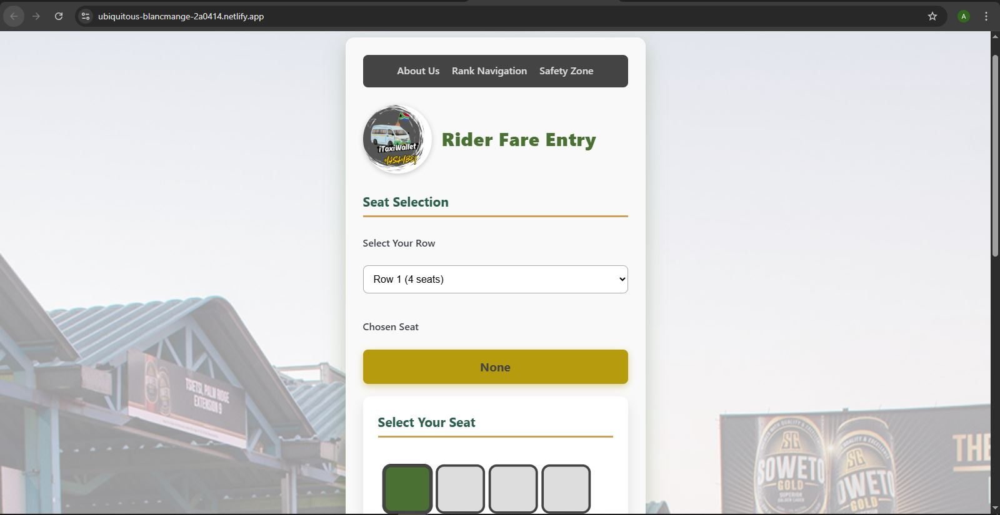

<!-- ====================================================== -->
<!--                       ASCII BANNER                     -->
<!--                       (INKOSII)                        -->
<!-- ====================================================== -->

<pre>
  ____   _                      _      _         _      _         
 / ___| (_) _ __    ___  _ __  | |__  | |  __ _ | |__  | |  __ _  
 \___ \ | || '_ \  / _ \| '_ \ | '_ \ | | / _` || '_ \ | | / _` | 
  ___) || || | | ||  __/| | | || | | || || (_| || | | || || (_| | 
 |____/ |_||_| |_| \___||_| |_||_| |_||_| \__,_||_| |_||_| \__,_| 
   ___   _         _                  _   _  _                _   
  / _ \ (_) _ __  (_) ___   ___      | \ | || | __ ___   ___ (_)  
 | | | || || '_ \ | |/ __| / _ \     |  \| || |/ // _ \ / __|| |  
 | |_| || || | | || |\__ \| (_) |    | |\  ||   <| (_) |\__ \| |  
  \__\_\|_||_| |_||_||___/ \___/     |_| \_||_|\_\\___/ |___/|_|  
</pre>

---

<!-- ====================================================== -->
<!--                      HEADER BANNER                     -->
<!-- ====================================================== -->

  

<!-- ====================================================== -->
<!--                    ANIMATED JOKE                       -->
<!-- ====================================================== -->

  

---

## 👋 About Me

**Sinenhlahla Qiniso Nkosi** — Junior Software Developer with a **BSc in Applied Mathematics & Computer Science**.

I build **backend systems** and **analytical tools** with clear structure, elegant logic, and a bit of flair.
- 🎯 **Primary:** Java for backend architecture and system design
- 📊 **Data & Viz:** Python (Pandas, NumPy) + Streamlit/Gradio for interactive dashboards
- 🌐 **Frontend:** HTML5, CSS3, JavaScript

---

<!-- ====================================================== -->
<!--                    CONTRIBUTION GRAPH                  -->
<!-- PAC-MAN Animation (dark/light mode support)           -->
<!-- ====================================================== -->

  <picture>
    <source media="(prefers-color-scheme: dark)" srcset="https://raw.githubusercontent.com/inkosii/inkosii/output/pacman-contribution-graph-dark.svg">
    <source media="(prefers-color-scheme: light)" srcset="https://raw.githubusercontent.com/inkosii/inkosii/output/pacman-contribution-graph.svg">
    
  </picture>

---

## 🛠️ Tech Stack & Tools

   
  

| **Domain** | **Skills** |
|---|---|
| **Backend** | Java, OOP, REST APIs, Unit Testing, Design Patterns |
| **Data & Analysis** | Python, Pandas, NumPy, Time-series Analysis, scikit-learn |
| **UI & Web** | HTML5, CSS3, JavaScript, Streamlit, Gradio |
| **DevOps** | Docker, Git, GitHub, CI/CD |
| **Soft Skills** | System design thinking, Problem solving, Quantitative reasoning |

---

## 🚀 Featured Projects

### 1️⃣ Eskom Load Shedding Impact Analysis

**Goal:** Quantify and visualize how load-shedding affects economic output, municipal demand, and household behavior using real **StatsSA datasets**.

**What I built:**
- ✅ Sourced and cleaned StatsSA electricity, municipal, and GDP datasets
- ✅ Built time-series models (decomposition, rolling forecasts, regression analysis)
- ✅ Measured correlations between load-shedding severity and sectoral GDP impact
- ✅ Developed Streamlit dashboards + Gradio previews for stakeholder consumption
- ✅ Packaged with Docker for reproducible, scalable deployment

**Stack:** `Python` • `Pandas` • `NumPy` • `scikit-learn` • `Streamlit` • `Docker`

---

### 2️⃣ SA Taxi Fare & Route App

  

**What it does:** Browser-based app for finding taxi fares, seat selection (interactive SVG), QR payments, rank navigation, and commuter safety information.

**Features:**
- 🔍 Smart autocomplete for routes
- 🎤 Voice-search integration
- 💺 Visual seat selection with SVG rendering
- 📱 QR payment integration
- 🗺️ Rank/station mapping
- 🎨 Clean, SA-inspired UI

**Stack:** `HTML5` • `CSS3` • `JavaScript` • `Node.js` • `SVG` • `JSON` routes

---

## 📬 Get In Touch

| Channel | Details |
|---|---|
| **Email** | snenkosi41@gmail.com |
| **GitHub** | [@inkosii](https://github.com/inkosii) |

---

  ✨ <strong>Crafted with ☕ Java, 🔧 gears, and a love for clean systems</strong> ✨

